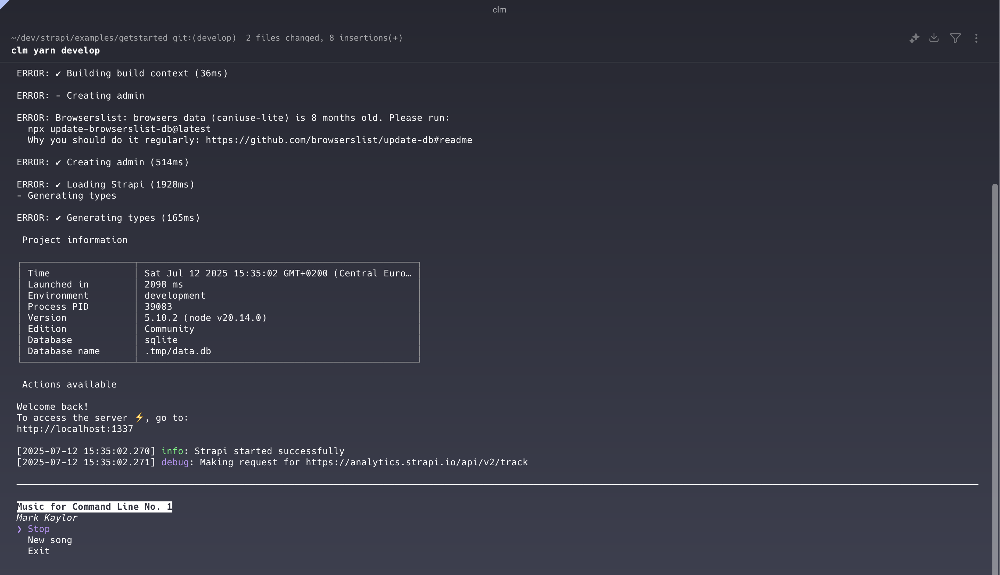

# Command Line Music


iPod-shuffle style audio player for the command line.

`clm` starts playing music and then runs the provided commands.

A command line interface is available to stop/start playing music, choose a new song, or exit the program.

## Install

From the root of this directory, build the project

```
yarn build
```

Install the command line interface globally

```
npm install -g .
```

## CLI

```
# Usage
clm <commands>

# Example
clm yarn install
```

## Development

Install dependencies

```
yarn install
```

Run dev watch mode

```
yarn dev
```

In another terminal, launch the CLI

```
node ../<path-to-clm>/dist/cli.js yarn install
```

## Music

The music files in the `music/` directory are licensed under the Creative Commons Attribution-NonCommercial 4.0 International License. `LICENSE_MUSIC.md` for details.

All music is permitted to be used solely for the purpose of this project. Under no circumstance should the music be used for any other purpose outside this project.
